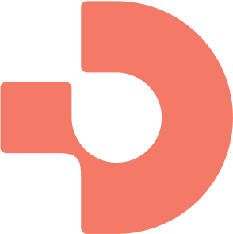

  
  
  <h1 align="center">Datum Cloud Portal</h1>
  
  

    Where magic happens
  

    
    
    
    
    
    

# Project Overview

This project is a Remix-based web application designed for scalability, maintainability, and performance. It follows best practices in project structure, state management, API communication, and UI development to ensure an efficient developer experience and a high-quality user interface.

Key Features

- Modular Structure: Feature-based organization with clear separation of concerns.
- Modern UI Components: Built with React, TypeScript, shadcn/ui, and Tailwind CSS for a consistent and efficient design.
- State Management: Uses Jotai for lightweight state or Zustand/TanStack Query for scalable state handling.
- Optimized API Communication: Centralized API service layer with efficient data fetching using TanStack Query.
- Performance Enhancements: Server components, lazy loading, memoization, and Remix-specific optimizations.
- [WIP] Robust Testing: Includes unit, integration, and end-to-end (E2E) tests using Jest, React Testing Library, and Cypress/Playwright.
- Accessibility (A11y): Follows WCAG guidelines, ensuring keyboard navigation and screen reader support.
- Code Quality: Enforces linting, formatting, and Git hooks with Prettier, ESLint, and Husky.
- CI/CD & Deployment: Uses GitHub Actions, environment configuration, feature flags, and monitoring tools like Sentry.

# Getting Started

- [Development guide](infra/docs/development.md)
- [Design guide](infra/docs/design.md)
- [Deployment guide](infra/docs//deployment.md)
