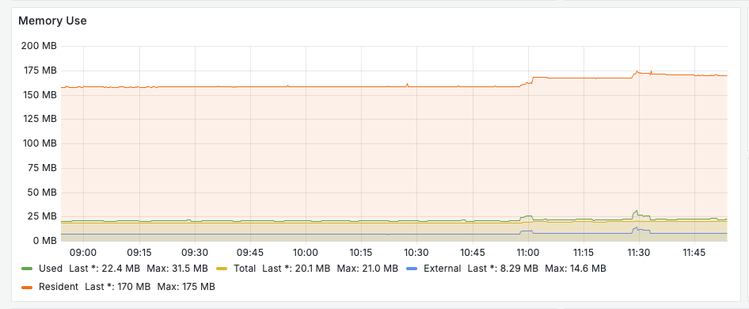
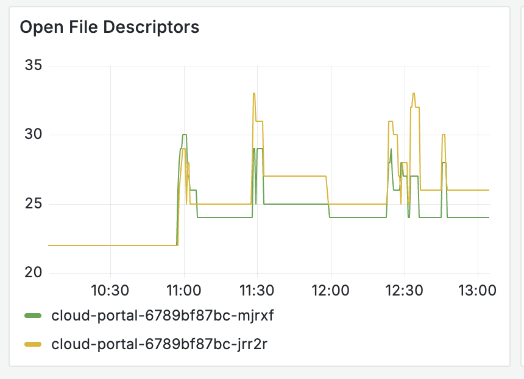

# Dashboard explained

[Staging grafana dashboard](https://grafana.staging.env.datum.net/d/deicyjvtfy800e/cloud-portal?orgId=1&from=now-3h&to=now&timezone=browser&var-pod=$__all&var-resolution=30s&var-query0=1m&var-interval=1m)

## Memory use

The chart display the following stacked information:

- nodejs_heap_size_used_bytes: Shows how much memory is actually used by V8’s JS heap.
- nodejs_heap_size_total_bytes: Allocated heap (might be larger than used)
- nodejs_heap_size_limit_bytes: V8 limit (based on --max-old-space-size)
- nodejs_external_memory_bytes: Memory used by “external” resources — things allocated by C++ bindings, like Buffers and other native modules.

  This is non-JavaScript memory — it’s memory allocated by native code but linked to JS objects so the garbage collector still knows about them.

  Common sources:

  - Buffer objects (e.g. Buffer.alloc(10000))
  - Native modules written in C/C++\*
  - WebAssembly, or bindings to native libraries (e.g. ffi, sqlite3, image/video processors)
  - Sometimes libraries using node-gyp or N-API

  This is tracked, because V8’s garbage collector needs to have some awareness of how much memory your app is using — even if it didn’t allocate it directly.

  It doesn’t manage external memory, but it will slow down allocations or trigger GC sooner if external_memory is high — to help avoid total memory blowups.

## Open File Descriptors

This graph show `open_handles_total`, which is especially useful when you’re dealing with:

- Leaking file handles
- Forgotten sockets
- Hanging HTTP requests
- Unclosed streams, timers, or DB connections

If this number steadily increases over time — and doesn’t drop — it usually means resources are being created but not cleaned up.

How to interpret it

Flat or spiky Normal (e.g., requests coming in, getting cleaned up)
Steady upward slope 🚨 Potential leak (open handles are accumulating)
High value without traffic Suspicious — something may be stuck

What are file descriptors?

File Descriptors (FDs) = Handles to “things”

They’re numbers the OS gives to your process to represent open resources like:

- Files Opened with fs.open() or fs.createWriteStream()
- Sockets HTTP requests, WebSockets, etc.
- Pipes Between processes
- Timers setInterval, setTimeout (these keep the event loop alive)
- Streams File or network streams
- DB connections Pools not properly released

Each of these uses a file descriptor under the hood. They’re finite — open too many and you hit EMFILE (too many open files)

## Red flags:

- heap_size_used climbs steadily over hours/days → potential JS leak.
- external_memory_bytes grows → possible Buffer or native addon leak.
- resident_memory_bytes grows faster than JS heap → could be native, file descriptors, threads, or other OS-level leaks.
