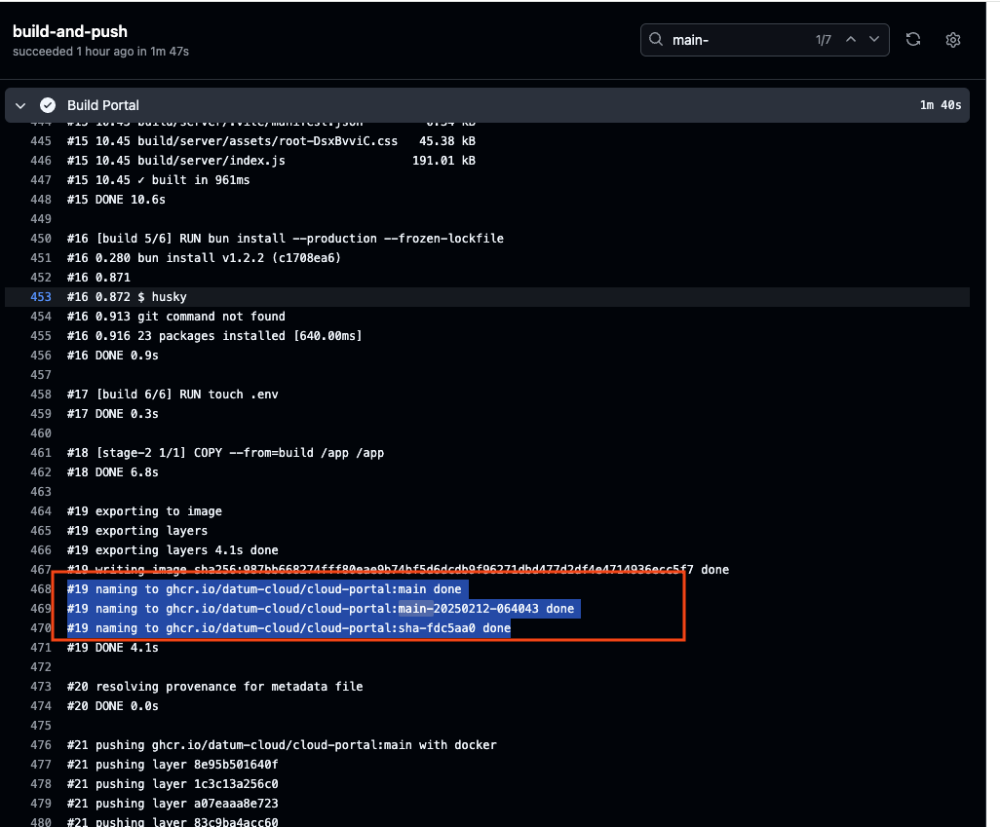

<p align="center">
  
  
  <h1 align="center">Deployment</h1>
  
  <p align="center">
    Infrastructure as Code
  </p>
</p>

# Pulumi

We use Pulumi to define and manage our infrastructure as code (IaC) using TypeScript. Pulumi allows us to provision, update, and manage our Google Cloud Kubernetes cluster with a familiar programming language—eliminating the burden of writing YAML files.

For more details, check out the official [Pulumi GitHub](https://github.com/pulumi/pulumi) repository or [documentation](https://github.com/pulumi/pulumi?tab=readme-ov-file#welcome).

# Infra

The code that manages how the portal is deployed is located[here](https://github.com/datum-cloud/datum-infra/blob/main/apps/datum-cloud-portal/index.ts).

We have two environments: **Staging** and **Production**. Settings for each environment are stored in:

- [Staging values](https://github.com/datum-cloud/datum-infra/blob/main/apps/datum-cloud-portal/Pulumi.staging.yaml)
- [Production values](https://github.com/datum-cloud/datum-infra/blob/main/apps/datum-cloud-portal/Pulumi.prod.yaml)

# Deploying

## Staging

The [datum-infra](https://github.com/datum-cloud/datum-infra/) repository contains a [devcontainer](https://github.com/datum-cloud/datum-infra/tree/main/.devcontainer) file that has all the necessary settings and tools to use Pulumi for deploying to our our Google Cloud project. Clone the repository, open it using [Visual Studio Code](https://code.visualstudio.com/docs/devcontainers/containers) and load the environment.

Once the environment is ready, please follow the [Deploying to the staging environment](https://github.com/datum-cloud/datum-infra/blob/main/README.md#deploying-to-the-staging-environment) instruccions.

## Deploying a specific tag

If you want to deploy a branch you are working on or the latest from main, you could simple change the [image tag here](https://github.com/datum-cloud/datum-infra/blob/main/apps/datum-cloud-portal/Pulumi.staging.yaml#L17). You can grab the image tag from the [Publish Portal](https://github.com/datum-cloud/cloud-portal/actions/workflows/publish.yaml) github action.



## Production

Whenever you want to deploy to production, you must summon our Jedi Lord Scotobi. May the Force be with you.


## Connecting to the Staging cluster

https://github.com/datum-cloud/datum-infra/blob/main/docs/10-setup/01-configuring-gcloud.md

```
gcloud config set auth/impersonate_service_account developer@datum-cloud-staging.iam.gserviceaccount.com

gcloud auth application-default login --impersonate-service-account developer@datum-cloud-staging.iam.gserviceaccount.com

gcloud auth login --impersonate-service-account developer@datum-cloud-staging.iam.gserviceaccount.com

gcloud components install gke-gcloud-auth-plugin

gcloud container clusters get-credentials infrastructure-control-plane --region us-east4 --project datum-cloud-staging

k get pods -n cloud-portal
```
