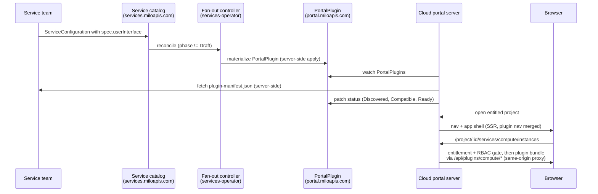

# Portal Plugin System: Dynamic Service UI Plugins

**Status:** Proposed
**Date:** 2026-07-11
**Related:** [milo-os/service-catalog](https://github.com/milo-os/service-catalog) (`docs/enhancements/service-registry.md`, `docs/enhancements/service-enablement-architecture.md`)

---

## Summary

Today, every service that wants a presence in the cloud portal needs the portal team to build it: new routes in `app/routes.ts`, new nav items, new resource modules, and a portal release. This enhancement makes the portal **extensible by the platform itself**. A service team registers their service in the Milo service catalog and declares that it ships a UI plugin. The platform automatically materializes that declaration into a **`PortalPlugin`** resource — a new Custom Resource Definition owned by the portal — and the portal discovers the plugin, learns which routes, navigation items, and features it contributes, and loads its UI at runtime. No portal code change, no coordinated deploy.

The design follows the same idiom the service catalog already uses for billing and quota: service teams **declare** their capability once in their `ServiceConfiguration`, and a controller **fans it out** into the consuming system's API group. The portal-side runtime borrows the proven shape of OpenShift Console dynamic plugins: a CRD that points at the plugin's assets, a `plugin-manifest.json` describing typed extension points, and module-federated UI loaded through the portal's own origin.

## Motivation

The portal is becoming the bottleneck for platform growth. Each new service (compute, networking, DNS, telemetry, …) lands in the portal only as fast as the portal team can hand-build its pages. Meanwhile the service catalog already gives services a self-service registration path for identity, billing, quota, and metering — the UI is the one capability a service cannot yet bring with it.

`app/features/quotas/service-catalog.ts` is the symptom: a hardcoded, manually-maintained mirror of the service registry inside the portal, annotated as an "interim mirror of the future milo-os/service-catalog `Service` registry." This enhancement replaces hand-maintained coupling with platform-driven discovery.

### User stories

- **As a service team**, I can ship and iterate on my service's portal experience on my own release cadence, from my own repository, using the platform's design system — without opening PRs against the portal or waiting for a portal deploy.
- **As a platform operator**, I control which plugins are live through the same governed catalog lifecycle that controls billing and quota, and I can suspend a misbehaving plugin platform-wide with a single field change.
- **As a customer**, when my project enables a service, that service's UI appears in my project navigation automatically — with the same look, feel, auth, and permissions behavior as every built-in page. Services I haven't enabled are invisible.

## Goals

- A service team can ship a portal UI without touching the cloud-portal repository or coordinating a portal deploy.
- Plugin registration flows through the **same catalog resource** service teams already author (`ServiceConfiguration`), with the same `Draft → Published → Deprecated → Retired` lifecycle.
- Plugins are visible **only** in projects with an `Active` `ServiceEntitlement` for the service, and pages render **only** when the user passes Kubernetes RBAC checks — both fail-closed.
- The browser never contacts a plugin-owned origin directly; all plugin assets and backend calls are mediated by the portal.
- A service repository can see its plugin running inside the real portal locally within minutes, and can test the actual CRD registration path against a lightweight local Kubernetes API.

## Non-goals (v1)

- Third-party or untrusted plugin authors. This design is for first-party and platform-vetted service teams (see [Security & trust model](#security--trust-model)).
- Server-side rendering of plugin components. Plugin pages hydrate client-side; the app shell and navigation remain SSR.
- Plugins overriding host-owned pages, navigation, or chrome.
- A plugin marketplace, per-user enablement, or per-org plugin version pinning.

## Architecture overview



Five key ideas:

1. **Declare in the catalog, materialize in the portal's API group.** Services never author `PortalPlugin` resources directly. A `spec.userInterface` block on `ServiceConfiguration` is fanned out by the services-operator — exactly how billing and quota declarations become `billing.miloapis.com` resources today. The write path *is* the trust boundary.
2. **The portal watches, then discovers.** The portal server watches `PortalPlugin` resources, fetches each plugin's `plugin-manifest.json` server-side, validates it, and records health in the resource's `status` — observable via `kubectl get portalplugins`.
3. **Typed extension points, not arbitrary DOM.** A plugin declares *what* it contributes (nav items, pages, cards) through a closed, versioned vocabulary. The portal stays in control of where plugin UI can appear.
4. **Static mount, dynamic content.** The portal's route tree gains one permanent catch-all mount (`/project/:projectId/services/:serviceSlug/*`). Plugin routes resolve inside that mount at runtime, so the compiled React Router route tree never changes and no rebuild is needed per plugin.
5. **Same-origin mediation.** Plugin assets load through the portal server (`/api/plugins/<slug>/…`), and plugin backend calls go through the portal's existing authenticated proxy. Plugin origins are never exposed to the browser.

## Registering a plugin: the service side

A service team adds one optional block to the `ServiceConfiguration` they already maintain:

```yaml
apiVersion: services.miloapis.com/v1alpha1
kind: ServiceConfiguration
metadata:
  name: compute-v1-4
spec:
  serviceRef:
    name: compute
  version: "1.4.0"
  phase: Published
  # ... existing billing / quota / metrics / locations blocks ...

  userInterface:
    # DNS-label slug; becomes /project/:id/services/<slug>/… in the portal
    # and the asset-proxy prefix. Uniqueness enforced at fan-out time.
    slug: compute
    assets:
      # HTTPS origin (service-team-operated) serving the built plugin:
      # plugin-manifest.json, remote entry, chunks, static assets.
      baseURL: https://portal-plugin.compute.miloapis.com
      manifestPath: /plugin-manifest.json   # optional; this is the default
      caBundle: ""                          # optional PEM for internal CAs
    # Named non-Milo backends the plugin may call through the portal.
    # Milo control-plane data needs NO entry — the portal's existing
    # authenticated proxy to scoped control planes covers it.
    proxy:
      - alias: metrics
        backend:
          url: https://metrics.compute.miloapis.com
        authorization: UserToken   # UserToken | None
    visibility:
      entitlement: Required        # Required (default) | None
      featureFlag: ""              # optional OpenFeature flag key
```

Lifecycle coupling comes free from the catalog:

- **Draft** configurations are skipped by the fan-out — nothing appears in the portal.
- **Published** materializes (or updates) the plugin.
- **Deprecated** keeps the plugin functional but flags it as deprecated in the portal.
- **Retired** — or removing the `userInterface` block — prunes the `PortalPlugin`, and the portal unloads the plugin on the delete event.

If several non-Draft configurations for one service declare `userInterface`, the highest `spec.version` wins; one live plugin version per service in v1.

**Why a block on `ServiceConfiguration` rather than a new provider-authored resource?** A UI declaration is the same species as a billing or quota declaration: a per-version statement of what the service contributes, materialized into the consuming system's API group by a controller. It inherits versioning (`spec.version`) and lifecycle gating with zero new machinery, and it avoids a second provider-authored resource that could drift out of sync. Alternatives considered: a field on `Service` (wrong granularity — no version, and it pollutes the deliberately slim identity resource) and a provider-authored `ServiceUserInterface` CRD (breaks the declare/materialize idiom and raises new RBAC questions the fan-out already answers).

## The `PortalPlugin` resource: the portal side

A new cluster-scoped CRD on **`portal.miloapis.com/v1alpha1`** with the `Platform` discovery context, mirroring how billing fan-out lands in the consumer's API group. Written only by the services-operator; consumed by the portal server, which also writes `status`.

```yaml
apiVersion: portal.miloapis.com/v1alpha1
kind: PortalPlugin
metadata:
  name: compute.miloapis.com           # deterministic: Service.spec.serviceName
  labels:
    app.kubernetes.io/managed-by: services.miloapis.com
    services.miloapis.com/service: compute.miloapis.com
  annotations:
    discovery.miloapis.com/parent-contexts: Platform
spec:
  serviceRef:
    name: compute                       # catalog Service object name
  serviceName: compute.miloapis.com     # canonical reverse-DNS id
  slug: compute                         # unique DNS label; URL + proxy segment
  displayName: Compute                  # copied from Service.spec.displayName
  deprecated: false                     # true when the winning configuration is Deprecated
  suspend: false                        # platform-operator kill switch
  assets:
    baseURL: https://portal-plugin.compute.miloapis.com
    manifestPath: /plugin-manifest.json
    caBundle: ""
  proxy:
    - alias: metrics
      backend:
        url: https://metrics.compute.miloapis.com
      authorization: UserToken          # UserToken | None
  visibility:
    entitlement: Required               # Required | None
    featureFlag: ""                     # optional OpenFeature flag key
    organizations: []                   # optional early-access allowlist; empty = all
  contentSecurityPolicy: []             # rarely needed; assets are same-origin proxied
status:
  observedGeneration: 3
  conditions:
    - type: Discovered                  # manifest fetched and schema-valid
      status: "True"
      reason: ManifestFetched
    - type: Compatible                  # manifest SDK range satisfied by host SDK
      status: "True"
      reason: SDKRangeSatisfied
    - type: Ready                       # aggregate: discovered + compatible + not suspended
      status: "True"
      reason: PluginLoaded
  manifest:                             # portal-resolved snapshot of the live manifest
    version: "1.4.0"
    sdkRange: "^1.0.0"
    digest: "sha256:9f2c…"
    fetchedAt: "2026-07-11T18:00:00Z"
    extensions:
      portal.nav/project: 1
      portal.page/project: 3
      portal.card/project-home: 1
```

The status subresource makes plugin health observable from the platform side: a service team sees `Discovered=False / ManifestFetchFailed` on their own resource without needing access to portal internals.

## Plugin discovery: the manifest

The portal fetches `{assets.baseURL}{manifestPath}` server-side — never from the browser — validates it against a published JSON schema, and caches by digest. The shape deliberately follows OpenShift Console's proven contract:

```json
{
  "name": "compute.miloapis.com",
  "version": "1.4.0",
  "sdk": {
    "name": "@datum-cloud/portal-plugin-sdk",
    "range": "^1.0.0"
  },
  "remoteEntry": "remote-entry.js",
  "exposedModules": {
    "InstanceList": "./src/pages/instance-list.tsx",
    "InstanceDetail": "./src/pages/instance-detail.tsx",
    "HomeCard": "./src/cards/compute-summary.tsx"
  },
  "extensions": [
    {
      "type": "portal.nav/project",
      "properties": {
        "id": "compute-instances",
        "title": "Instances",
        "icon": "cpu",
        "path": "instances",
        "order": 30
      },
      "requirements": {
        "permissions": [
          { "group": "compute.miloapis.com", "resource": "instances", "verb": "list" }
        ]
      }
    },
    {
      "type": "portal.page/project",
      "properties": {
        "path": "instances",
        "component": { "$codeRef": "InstanceList" }
      },
      "requirements": {
        "permissions": [
          { "group": "compute.miloapis.com", "resource": "instances", "verb": "list" }
        ]
      }
    },
    {
      "type": "portal.page/project",
      "properties": {
        "path": "instances/:instanceName",
        "component": { "$codeRef": "InstanceDetail" }
      },
      "requirements": {
        "permissions": [
          { "group": "compute.miloapis.com", "resource": "instances", "verb": "get" }
        ]
      }
    }
  ]
}
```

Contract rules:

- **`$codeRef`** is a lazy reference into `exposedModules` (`"ModuleName"` or `"ModuleName.exportName"`); no plugin code loads until an extension actually renders.
- **`icon` is a name, never code** — a lucide icon name resolved by the host. Navigation must render without executing plugin code, so a broken plugin can never take down the sidebar.
- **`path` is relative to the plugin's mount point.** Plugins cannot address URL space outside `/project/:projectId/services/<slug>/`.
- **`requirements.permissions`** are `SelfSubjectAccessReview` checks against the current project's scoped control plane — the same fail-closed gate the portal's built-in pages use. All listed permissions must pass for the extension to appear.

### Extension points

| Type | Status | Renders | Key properties |
|------|--------|---------|----------------|
| `portal.nav/project` | **v1** | Item in the project sidebar, grouped under a per-service section | `id`, `title`, `icon` (lucide name), `path`, `order` |
| `portal.page/project` | **v1** | Routed page under `/project/:projectId/services/<slug>/<path>` | `path` (supports params and nesting), `component: $codeRef` |
| `portal.card/project-home` | **v1** | Card on the project home page | `title`, `component: $codeRef`, `order` |
| `portal.nav/org`, `portal.page/org` | v1.x | Org-scoped nav and pages | same shapes, org-scoped RBAC |
| `portal.tab/resource` | v1.x | Extra tab on a host-owned resource detail page | `targetResource {group, kind}`, `title`, `component` |
| `portal.action/resource` | v1.x | Action-menu item on host resource rows/pages | `targetResource`, `title`, `component` |
| `portal.assistant/tool` | future | Tool contributed to the portal assistant | tool schema + `$codeRef` handler |

v1 ships exactly three extension points. The typed `{type, properties, requirements}` envelope makes growth additive: a portal that doesn't recognize an extension type records a status note and ignores it — never an error.

## Loading plugins in the portal

**Static mount, dynamic content.** The portal's route tree gains one permanent catch-all route, added once and never changed again:

```
/project/:projectId/services/:serviceSlug/*
/org/:orgId/services/:serviceSlug/*            (reserved for v1.x)
```

React Router v7 compiles its route tree at build time, so per-plugin route injection would require a portal rebuild or restart — exactly the coupling this design removes. The catch-all keeps the compiled tree static while plugin paths resolve inside the mount at runtime. The `services/` prefix permanently avoids collisions with host-owned routes.

The mount's **server loader** does everything trust-sensitive before a single plugin byte reaches the browser: session check, slug → `PortalPlugin` resolution from the server's watch cache, entitlement check for the current project, and RBAC evaluation for the extension matching the requested path — returning 404/403 fail-closed, the same posture as built-in pages. The mount's **client component** then loads the plugin's remote entry from the same-origin asset proxy, matches the remaining path against the plugin's `portal.page/project` extensions, and renders the referenced component. React Router is a shared singleton, so `useParams`, `Link`, and `useNavigate` behave identically inside plugin pages.

**Module Federation with host-pinned singletons.** Plugin bundles are loaded via Module Federation. The host provides shared singletons — `react`, `react-dom`, `react-router`, `@tanstack/react-query`, `@datum-cloud/datum-ui`, and the plugin SDK — so every plugin renders with the host's design system and router, and plugins cannot ship a divergent React.

**Server-side rendering, stated honestly:** plugin components are client-rendered. The server renders the app shell, the complete navigation (nav extensions come from the manifest, which the server holds), and a page skeleton; plugin pages hydrate on the client and fetch data exactly as built-in pages do client-side — including live updates through the portal's existing watch streaming. This matches OpenShift Console's model and keeps service-team code out of the portal's server process, which would be a materially worse trust position than the user's browser.

### Key interfaces for plugin authors

Two packages define the integration surface; service teams never hand-write bundler or manifest plumbing:

- **`@datum-cloud/portal-plugin-sdk`** — the versioned contract. TypeScript types for every extension point, plus runtime hooks:
  - `useProjectContext()` — current project/org identity and metadata.
  - `usePluginFetch()` — fetch pre-scoped to the current project's control plane, through the portal's authenticated proxy.
  - `usePluginProxyFetch(alias)` — fetch to a backend declared in `spec.proxy`.
  - `useResourceWatch()` — live resource updates through the portal's watch stream.

  The host advertises its SDK version; a manifest whose `sdk.range` doesn't match is not loaded (`Compatible=False`). Semver policy: additive changes are minor; extension-point removal is major with a deprecation window.

- **`@datum-cloud/portal-plugin-toolkit`** — build tooling. Wraps the Vite Module Federation configuration (correct shared modules and output layout) and generates + schema-validates `plugin-manifest.json` from a typed `plugin.config.ts`.

## Security & trust model

**Same-origin asset mediation.** A portal server route (`/api/plugins/<slug>/…`) proxies all plugin assets from `spec.assets.baseURL`: fetched server-side (honoring `caBundle`), served with `X-Content-Type-Options: nosniff`, no cookies or authorization forwarded to the plugin origin, immutable caching keyed by manifest digest. The browser's `script-src`/`connect-src` stay `'self'`.

**Backend calls, two tiers:**

1. *Milo control-plane data* (the common case): the portal's existing authenticated proxy to scoped control planes, unchanged. The plugin uses `usePluginFetch()`; the portal injects the user's session token; the project's control plane enforces authorization.
2. *Non-Milo backends*: `/api/plugins/<slug>/proxy/<alias>/…`, allowed only for aliases declared in `spec.proxy`. `UserToken` injects the session bearer token (the plugin backend validates it as an OIDC resource server against the same issuer); `None` forwards anonymously. There is no mechanism for a plugin to reach an undeclared host through the portal.

**Three fail-closed authorization layers:**

1. **Entitlement** — the plugin (nav, routes, cards) is invisible unless the current project has an `Active` `ServiceEntitlement` for the service. `visibility.featureFlag` optionally adds the portal's existing feature-flag gate; `visibility.organizations` supports early access.
2. **RBAC** — every extension's `requirements.permissions` run as `SelfSubjectAccessReview` checks with the user's own identity before the extension renders.
3. **Kill switch** — `spec.suspend: true` unloads the plugin portal-wide within one watch event.

**Activation is the governed write path, not a ceremony.** OpenShift requires a second admin approval because arbitrary cluster admins can install arbitrary plugins. Here, only the services-operator can write `PortalPlugin` resources, and only from a `ServiceConfiguration` whose `Service` was admitted to the catalog under a vetted producer project. A second human approval would be ceremony without a boundary. Gate = `Published` phase + entitlement + `suspend`. (During beta, a portal-side allowlist restricts which plugins load; it is removed at GA.) The development-only registry sources described under [Local development environment](#local-development-environment) are hard-disabled outside development builds for the same reason: they are plugin-loading vectors.

**Residual risk, stated plainly.** Module-federated plugin code executes in the portal's JavaScript realm with full DOM access and the user's session ambient. A malicious or compromised plugin could exfiltrate anything the user can see, or act as the user within the portal. This design is therefore for **first-party and platform-vetted service teams only**. Compensating controls: the governed write path; same-origin asset mediation (a compromised asset host is cut off via `suspend`; digest pinning in status detects silent bundle swaps); host-owned CSP (plugin CSP additions are merged from an allowlisted directive set, never `unsafe-*`); audit-logged proxy calls. Supporting untrusted third-party plugins would require an iframe-sandboxed tier — out of scope for v1, but the manifest contract is shaped so that tier can be added without breaking changes.

## Plugin lifecycle flows

**Ship (first release):**

1. Service team scaffolds a plugin with the toolkit; the build produces `plugin-manifest.json`, the remote entry, and chunks; the team deploys them behind an HTTPS endpoint they operate.
2. The team adds `spec.userInterface` to their `ServiceConfiguration` and releases it through the normal catalog flow.
3. The fan-out controller materializes the `PortalPlugin`.
4. The portal's watch sees it, fetches and validates the manifest, checks SDK compatibility, patches status, and adds the plugin to its registry.
5. A user opens a project with an `Active` entitlement for the service: the plugin's nav items (passing RBAC) appear in the project sidebar.
6. Navigating to a plugin page loads the bundle through the asset proxy and renders it; data flows through the portal's authenticated proxy and watch streams.

**Update:** the team deploys new assets (new manifest `version`, hashed chunk names; old chunks kept briefly for in-flight sessions) and bumps their `ServiceConfiguration`. The fan-out reapplies, the portal refetches on the watch event (plus periodic re-poll with digest comparison), and users get the new bundle on next navigation. No portal deploy.

**Deprecate / remove:** `Deprecated` phase sets `spec.deprecated` — the portal shows a deprecation affordance while the plugin stays functional. `Retired` phase (or removing `userInterface`) prunes the `PortalPlugin`; the portal unloads it on the delete event, nav vanishes, and mount URLs return 404. Emergency: a platform operator sets `suspend: true`.

## Local development environment

The guiding principle: **the platform control plane stays remote; the local environment is the plugin registry.** The portal in dev mode continues to authenticate and fetch orgs, projects, entitlements, and all existing resources from the remote environment exactly as `bun run dev` does today. What runs locally is only what this enhancement adds: the plugin registry, the plugin under development, and the portal. This keeps the harness small enough for every service repository to adopt, while still exercising the real registration machinery.

This works because plugin discovery sits behind a **pluggable registry source** in the portal server:

| Source | Config | What it does | When |
|--------|--------|--------------|------|
| `platform` | default | Watch `PortalPlugin` resources on the platform control plane | Production / staging |
| `static` | `PORTAL_PLUGINS="<slug>=<url>,…"` | Synthesize registry entries directly from URLs — no Kubernetes anywhere | Tier 0: fastest inner loop |
| `kubeconfig` | `PLUGIN_REGISTRY_KUBECONFIG=<path>` | Watch `PortalPlugin` resources on a local lightweight cluster | Tier 1: full-fidelity integration loop |

The `static` and `kubeconfig` sources are hard-disabled outside development builds — they are plugin-loading vectors and must never exist in production. They compose: `static` entries win on slug collision, so one plugin can be overridden while the rest come from the local registry.

### Tier 0 — direct plugin override (no Kubernetes at all)

The fastest inner loop for pure UI iteration, borrowed from OpenShift Console's dev-mode plugin flag:

```bash
PORTAL_PLUGINS="compute=http://localhost:7777" bun run dev
```

For each entry the portal synthesizes the equivalent of a `PortalPlugin` and runs the identical pipeline from there: server-side manifest fetch, schema and SDK-range validation, asset proxying, module-federated loading under the catch-all mount. It is byte-for-byte the production loading path — only discovery is short-circuited.

One constraint learned in implementation: a plugin loaded **through the portal's asset proxy must be the built output** (`task plugin:preview` — build + serve static assets), because a Vite dev server's remote entry imports host-absolute module URLs (`/node_modules/.vite/deps/…`) that don't resolve through the proxy. `task plugin:dev` remains the standalone HMR loop (browser hits the plugin dev server directly). True HMR-through-the-proxy is deferred to v1.x with an agreed direction that preserves the same-origin guarantee (plugins must never load from a non-portal origin, even in dev): first, serving the dev plugin under a Vite `base` of `/api/plugins/<slug>/` so dev-server module URLs resolve through the proxy — noting this requires the prefix to agree at three points (the server-side manifest fetch, the proxy's prefix-stripping forward, and Vite's base), so it is a small coordinated change, not a config-only tweak; then, forwarding the Vite HMR WebSocket through the asset proxy for full auto-reload.

Dev-sourced plugins get relaxed gating and render with a visible "dev plugin" badge: entitlement, feature-flag, and org gating are skipped (the remote catalog has no `ServiceEntitlement` for a service that doesn't exist yet), and RBAC `requirements` still evaluate against the real remote project but surface failures as dev-overlay warnings rather than blocking, since the service's RBAC may not be deployed remotely either. Data calls hit real remote APIs and fail naturally if the backing service isn't there — honest feedback, not a mock.

### Tier 1 — local plugin registry (the CRD registration path)

The full-fidelity loop, for testing the actual Kubernetes registration and discovery machinery. A shared harness — published by the portal team as a Taskfile include with a pinned CLI, consumed identically by the cloud-portal repo and service repos — stands up a **lightweight local Kubernetes API** using `kwokctl`: a real kube-apiserver and etcd that start in ~1–2 seconds with a tiny footprint and no kubelet, and faithful watch semantics — which matter, because the portal's registry client is a real Kubernetes watch and the fan-out depends on real CRD validation. (kind/k3d were rejected as full clusters with kubelets and 30–60 s startups the registry doesn't need; a mocked JSON registry was rejected because it breaks watch fidelity and skips the very CRD contract this tier exists to exercise.)

`task portal:registry` stands up:

1. **Cluster** — `kwokctl create cluster`, kubeconfig written to `.devenv/kubeconfig` (loopback-only; no auth story needed).
2. **CRDs only** — `portal.miloapis.com` (`PortalPlugin`) and the `services.miloapis.com` catalog types. No Milo org/project types, no auth config — the platform stays remote.
3. **Fan-out controller** — the `userInterface → PortalPlugin` projection, so applying a `ServiceConfiguration` locally exercises the same materialization that runs in production. (A `PortalPlugin` can also be applied directly when only the portal contract is under test.)

### Authenticating local development with datumctl

The local environment deliberately keeps the platform remote, which raises the question of how a local portal session and local tooling authenticate. `datumctl` answers it without any new infrastructure:

- **Dev sessions via `datumctl auth get-token`.** The portal exposes a development-only `POST /api/auth/dev-session` endpoint (gated behind `NODE_ENV=development` and an explicit env flag) that exchanges a datumctl-issued bearer token for a normal portal session cookie. Developers and test harnesses (the Playwright suite's global setup uses exactly this) skip the browser OIDC flow entirely: `datumctl auth get-token` → one POST → authenticated session backed by the real platform.
- **Platform-backed registry via `datumctl auth update-kubeconfig`.** The portal's `kubeconfig` registry source supports Kubernetes **exec credential plugins**, and `datumctl auth update-kubeconfig` writes exactly that: a kubeconfig whose credentials are fetched (and auto-refreshed) by datumctl. Pointing `PLUGIN_REGISTRY_KUBECONFIG` at such a kubeconfig makes the *same code path* that watches the local kwok registry watch a real platform control plane — no tokens copied anywhere.
- **Proposed follow-up: `datumctl api proxy`.** A kubectl-proxy-style local authenticated proxy (datumctl listens on a loopback port, forwards to the active session's API endpoint, injects and refreshes the bearer token) would collapse the remaining token plumbing: the portal dev server would set `API_URL=http://localhost:<port>` and need no platform credentials at all, and any local tool (curl, controllers, test harnesses) would get authenticated platform access for free. Watch/SSE streaming passthrough is the key requirement. This is a datumctl feature request, tracked separately.

### Service repository workflow

```bash
$ task portal:registry       # kwok + CRDs + fan-out (~5 s)
$ task plugin:dev            # plugin dev server on :7777 (manifest + remote, HMR)
$ kubectl --kubeconfig .devenv/kubeconfig apply -f config/portal/
                             # your Service + ServiceConfiguration,
                             # assets.baseURL: http://localhost:7777
$ PLUGIN_REGISTRY_KUBECONFIG=.devenv/kubeconfig bun run dev

# log in with your real remote account, open a real project —
# your plugin's nav item is there
```

This tier exercises the registration contract end to end: `userInterface` validation, fan-out create/update/prune semantics, deterministic naming and slug uniqueness, and manifest discovery conditions. `kubectl get portalplugins` against the local registry shows `Discovered` / `Compatible` / `Ready` exactly as production would, because the portal writes status back to whichever registry it watches. Update and removal flows — bump the version, retire the configuration — are testable locally before anything touches a shared environment.

**Which tier when:** daily UI iteration is Tier 0 — nothing running but two dev servers. Registration and lifecycle work — authoring the `userInterface` block, verifying fan-out output, testing update and deprecation flows — is Tier 1.

### Portal repository workflow

Portal contributors use the same two tiers, plus `examples/sample-plugin/`: a reference plugin exercising every v1 extension point. It doubles as living documentation for plugin authors and as the end-to-end test fixture — Tier 0 for extension-point work, Tier 1 for registry-client work.

### Continuous integration

- **Portal repo:** no Kubernetes required — contract tests pinning the manifest JSON schema per SDK version, plus a smoke test loading the sample plugin via the Tier 0 override.
- **Service catalog repo:** `envtest` (the controller-runtime standard: pinned kube-apiserver + etcd binaries, no Docker) covers the fan-out controller — create, update, prune, phase-transition, and version-precedence behavior.
- **Service repos:** toolkit-provided manifest schema validation on every build, plus an optional `envtest`-based check that their `ServiceConfiguration` materializes the expected `PortalPlugin` — it needs only the two CRD sets, so it stays cheap and fast.

## Alternatives considered

| Alternative | Why rejected |
|---|---|
| Provider-authored plugin CRD (services write `PortalPlugin` directly) | Breaks the catalog's declare/materialize idiom; loses lifecycle coupling for free; opens a new RBAC surface the fan-out already governs |
| UI declaration on `Service` instead of `ServiceConfiguration` | No version dimension; pollutes the deliberately slim identity resource |
| Boot-time route injection into the compiled route tree | Requires a portal restart per plugin change — dynamic in name only; fights the framework on every upgrade |
| Portal rebuild per plugin | Makes the portal build a bottleneck for every service team — reintroduces the coupling this design removes |
| iframe-sandboxed plugins | Strongest isolation, but heavy UX seams, duplicated dependencies, no shared design system; reserved as a future tier for untrusted authors |
| Manual portal-side plugin activation step | Duplicates catalog governance; the governed write path is the boundary |
| kind/k3d/kcp for local development | Full clusters are heavier and slower than the job needs; kcp adds a workspace model and drops APIs tooling expects |

## Open questions

1. **Portal platform identity** — the portal server needs its own credential to `list/watch` `PortalPlugin` resources and patch status (today it holds only end-user tokens). Machine-account provisioning needs an owner.
2. **Token audience for proxied backends** — is the session access token acceptable to non-Milo resource servers as-is, or does v1.x need per-alias token exchange (RFC 8693)?
3. **Multi-version coexistence** — v1 is one live plugin version per service. Is per-org version pinning (canarying a plugin to select orgs) a near-term need?
4. **Design system as a shared singleton** — partially resolved: the host shares a curated subset of `@datum-cloud/datum-ui` subpath modules as host-backed singletons (badge, button, card, empty-content, icons, separator, skeleton, table — see the host's federation host module), so plugins render pixel-identical to built-in pages with zero duplication. Remaining: ratify the curation list with the design-system team and re-export it through the plugin SDK with a semver-stability guarantee.
5. **Gated services** — entitlement gating makes pending/rejected services invisible; should a pending request instead render a "request access" teaser?
6. **Dev-mode gating posture** — the local environment skips entitlement gating and downgrades RBAC failures to warnings for dev-sourced plugins; confirm that default, or keep RBAC blocking with a per-run opt-out.
7. **Pre-release staging path** — once a plugin passes the local Tier 1 loop, what's the process for registering the service in the staging catalog so the team can validate with real entitlements before production?
8. **Interim catalog mirror** — `app/features/quotas/service-catalog.ts` should collapse onto `PortalPlugin`/`Service` display metadata once this ships; that migration should be sequenced with this work.
