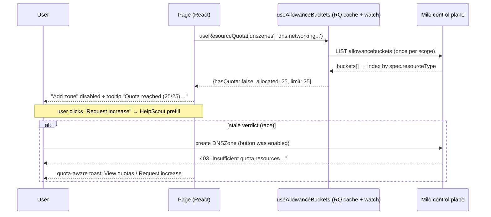

# Quota-Aware UI Gating: Blocking Actions on Insufficient Quota

**Status:** Research (pre-brainstorm)
**Date:** 2026-08-02
**Issue:** [datum-cloud/cloud-portal#1365](https://github.com/datum-cloud/cloud-portal/issues/1365) — "Improve how quotas are exposed to users"
**Reference architecture:** `app/modules/rbac/` (`README.md`, `ARCHITECTURE.md`, `CONVENTIONS.md`)
**BE reference:** Milo quota engine (`quota.miloapis.com/v1alpha1`) — `datum/milo`, service quota config in `datum/datum` and `network-services-operator`

---

## Summary

When a project or organization runs out of quota, resource creation fails with an opaque
403: _"Insufficient quota resources available."_ Users don't know which quota they hit,
that quotas are listed under Settings → Quotas, or that a "Request Limit" button exists.
Issue #1365's direction (from Matt): **"expose quotas like we do with permissions — stop
buttons being clickable with a tooltip if the resource has run out of quota."**

This document is the research base for that work. It dissects how `app/modules/rbac`
achieves permission-aware UI (the architecture we want to mirror), how the Milo quota
backend actually works (what the UI can and cannot know), what quota surface already
exists in the portal, and the gaps between them. It ends with a proposed shape for an
`app/modules/quota` module and open questions for brainstorming.

**Headline findings:**

1. The "is there quota?" predicate is **already shipped** in this codebase — the
   OpenFeature provider (`app/modules/feature-flags/milo-provider.ts`) gates feature
   flags on `AllowanceBucket.status.available > 0`. Quota gating for countable
   resources is the Entity/Allocation sibling of that shipped Feature pattern.
2. Unlike RBAC (N point-in-time SSAR checks), quota state for an entire scope arrives
   in **one LIST** of AllowanceBuckets — and the existing SSE watch infrastructure can
   keep it live with zero infra changes. The data strategy should look more like
   feature flags than like RBAC's per-check queries.
3. Quota gating must be **advisory (fail-open)**, the inverse of RBAC's fail-closed
   posture: bucket status is eventually consistent, a missing bucket means "unmetered"
   not "exhausted", and the admission 403 remains the only authoritative gate.

---

## The problem (issue #1365)

The raw error a user sees today:

```
dnszones.dns.networking.miloapis.com "edge-datum-net-tu60bt" is forbidden: Insufficient
quota resources available. Review your quota usage and reach out to support if you need
additional resources.
```

Goals from the issue:

- The quota error should point at the list of quotas (Settings → Quotas), so users skip
  guessing where to observe and increase quotas.
- Users should be able to quickly react to a quota error by filing a specific quota
  increase ticket.

Plus the assigned direction: proactively disable actions (with an explanatory tooltip)
when quota is exhausted — exactly how `<PermissionButton>` handles missing permissions.

---

## Part 1 — Reference architecture: how `app/modules/rbac` works

### 1.1 The four-layer model

Every resource route operates at four layers (from `ARCHITECTURE.md`):

| Layer                             | Responsibility                                                            | Primitive                                                                               |
| --------------------------------- | ------------------------------------------------------------------------- | --------------------------------------------------------------------------------------- |
| 1. Loader gate (server)           | Block denied requests before any data is fetched                          | `gateRouteAccess` via `defineResourceRoute` / `runListLoader` / `runDetailLoader`       |
| 2. Data fetch/watch (client)      | Skip fetches when the user lacks the verb                                 | `enabled: canX` on every `useX` / `useXWatch`                                           |
| 3. UI primitive (client)          | Render permission-aware                                                   | `<PermissionButton>` / `<PermissionGate>` / `<RestrictedState>` / `<RestrictedOverlay>` |
| 4. Cross-resource action (client) | Gate buttons against the resource they **mutate**, not the page's primary | `<PermissionButton resource="..." />`                                                   |

Posture (verbatim): _"Server gate first. Client UX gate always. API rejection is the
final backstop. Toast is never used as a gate."_

### 1.2 Server flow: SelfSubjectAccessReview

```
route loader → runListLoader/runDetailLoader (run-resource-loader.ts)
  → gateRouteAccess (server/check-permission.ts)
    → RbacService.checkPermission (server/rbac.service.ts)
      → AccessReviewService.create (app/resources/access-review)
        → POST {scopedBase}/apis/authorization.k8s.io/v1/selfsubjectaccessreviews
```

Two orthogonal things are derived from `scope: 'org' | 'project' | 'user'`:

- **Base URL** (`resolveBaseURL`): org → `/apis/resourcemanager.miloapis.com/v1alpha1/organizations/{orgId}/control-plane`, project → `.../projects/{projectId}/control-plane`, user → `/apis/iam.miloapis.com/v1alpha1/users/me/control-plane`.
- **Namespace** (`resolveNamespace`): project → `'default'`, org → `organization-{orgId}`,
  user → `''` (cluster-scoped). Explicit `namespace` always overrides.

Client hooks never call the control plane directly; they hit two BFF endpoints
(`app/server/routes/permissions.ts`, Hono, auth + rate-limited):
`POST /api/permissions/check` and `POST /api/permissions/bulk-check` (max **50** checks;
server fans out `Promise.allSettled` of individual SSARs — there is no upstream batch
API, batching only saves browser round-trips).

**Fail-closed everywhere**: any error → `{allowed: false, denied: true}`; hooks map
missing results to `false`; `canInLoader` has `.catch(() => false)`.

### 1.3 Client data flow

- `RbacProvider` (mounted once in `app/layouts/private.layout.tsx`) holds only
  `{organizationId, projectId}` — no rule cache.
- `useCheckQuery` — single check. Query key: 9-element positional tuple
  `['permission', org, project, resource, verb, group, ns, name, scope]`,
  `staleTime: 5min`, `retry: 1`.
- `usePermissionCheck(checks[])` — one bulk POST, results keyed `${resource}:${verb}`,
  key `['permission-bulk', org, project, checks[]]`. Uses `isPending` (not `isLoading`)
  so a disabled query doesn't flash a denied verdict.
- `useResourcePermissions({resource, verbs, subResources})` — flattens primary verbs +
  sub-resources into one bulk call and derives named flags via `flagNameFor`:
  primary `list` → `canList`; sub-resource `{alias:'waf', verbs:['patch']}` → `canEditWaf`
  (verb→prefix map: list/get→View, create→Create, patch/update→Edit, delete→Delete).
- The single and bulk caches are **disjoint** — the same check via both paths issues two
  network requests. Accepted duplication.

### 1.4 UI primitives

- **`<PermissionButton>`** — renders the bare `<Button disabled={...}>` while loading
  **and** when allowed, toggling only `disabled`; only the definitively-denied state
  wraps in `<Tooltip>`. The no-remount behavior is load-bearing (in-flight click
  detachment, e2e flake fixed in #1273). While loading: disabled, no tooltip.
- **`<PermissionGate mode="hide" | "disable" | "fallback">`** — `disable` clones the
  child with `disabled: true` inside a tooltip (`'Verifying permissions…'` while
  loading, else `deniedReason`); `hide`/`fallback` render fallback while loading —
  **never show a verdict before resolution**.
- **`<RestrictedState>`** — full-page deny (lock icon + message), emitted by the DSL.
- **`<RestrictedOverlay>`** — `absolute inset-0` scrim for a section inside an allowed
  page. Tri-state at the call site: loading → `LoaderOverlay`, denied → overlay,
  allowed → nothing.
- **`<GuardedPage>`** — restricted → `RestrictedState` with no fetch/skeleton; allowed →
  seeds React Query cache from loader data, then renders.

### 1.5 The DSL and the client/server split

`defineResourceRoute` (client-safe: `Page`/`meta`/`handle`) is deliberately split from
`run-resource-loader.ts` (server-only: gate + fetch + companions + redirect). The split
is a hard Vite constraint — `gateRouteAccess → metrics → prom-client` must never reach
the browser bundle. Any quota DSL/loader helpers must mirror this split.

`DslLoaderData` is a discriminated union — `{restricted: true}` carries **no data**, so
denied users never receive a payload over the wire.

### 1.6 Conventions that made RBAC stick

`CONVENTIONS.md` defines a strict 1:1 primitive map and **banned patterns** enforced at
PR review: inline `{canX && <Button/>}`, bespoke conditional-tooltip helpers, and
post-hoc handler-level toast guards (`if (!canX) { toast.error(...); return; }`).
A quota module must ship equivalent primitives on day one, or contributors will be
forced into the banned shapes.

### 1.7 Observability

One metric: `rbac_permission_denied_total{resource, verb}` (prom-client Counter),
incremented only by `gateRouteAccess`, plus a structured `logger.warn`. Minimal label
cardinality is deliberate.

---

## Part 2 — The quota backend (Milo)

### 2.1 Domain model

Six resources in `quota.miloapis.com/v1alpha1` (Go types:
`milo/pkg/apis/quota/v1alpha1/`):

| Resource               | Scope      | Purpose                                                                       |
| ---------------------- | ---------- | ----------------------------------------------------------------------------- |
| `ResourceRegistration` | Cluster    | Declares a quota-able resource type (+ display metadata)                      |
| `ResourceGrant`        | Namespaced | Allocates capacity to a consumer (org/project/user)                           |
| `AllowanceBucket`      | Namespaced | **Aggregates grants, tracks consumption** (auto-created; the UI's read model) |
| `ResourceClaim`        | Namespaced | A consumption request, evaluated by the controller                            |
| `GrantCreationPolicy`  | Cluster    | Auto-creates grants on lifecycle events (defaults per tier)                   |
| `ClaimCreationPolicy`  | Cluster    | Auto-creates claims during admission (enforcement trigger)                    |

Enforcement is an in-process **admission plugin** (`ResourceQuotaEnforcement`,
`milo/pkg/quota/admission/plugin.go`) — it creates a ResourceClaim and synchronously
blocks (default timeout **30s**) until the claim is Granted or Denied.

### 2.2 AllowanceBucket: the type the UI cares about

```go
type AllowanceBucketSpec struct {
    ConsumerRef  ConsumerRef `json:"consumerRef"`  // {apiGroup, kind: Organization|Project|User, name}
    ResourceType string      `json:"resourceType"` // e.g. "dns.networking.miloapis.com/dnszones"
}
type AllowanceBucketStatus struct {
    ObservedGeneration    int64                  `json:"observedGeneration,omitempty"`
    Limit                 int64                  `json:"limit"`
    Allocated             int64                  `json:"allocated"`   // NOT "used"
    Available             int64                  `json:"available"`   // max(0, Limit - Allocated)
    ClaimCount            int32                  `json:"claimCount"`
    GrantCount            int32                  `json:"grantCount"`
    ContributingGrantRefs []ContributingGrantRef `json:"contributingGrantRefs,omitempty"`
    LastReconciliation    *metav1.Time           `json:"lastReconciliation,omitempty"`
}
```

Facts that shape the UI design:

- **No `conditions` on bucket status.** Freshness signals are `lastReconciliation` and
  `observedGeneration` only.
- **`available` is pre-clamped to ≥ 0** — `available === 0` is the exhausted signal.
- One bucket per unique `(consumerRef, resourceType)`.
- Bucket **names are opaque** (`bucket-<sha256hex>` of resourceType+kind+name). Never
  construct names — list the namespace and index by `spec.resourceType`.
  `spec.resourceType`, `spec.consumerRef.kind/.name` are **selectable fields**
  (`?fieldSelector=`); the only labels are `quota.miloapis.com/consumer-kind` and
  `consumer-name`.
- `resourceType` convention (unenforced but universal): **`<apiGroup>/<plural>`** —
  the same `(group, resource)` pair `<PermissionButton>` already takes. This makes a
  quota primitive prop-compatible with the RBAC ones.

`ResourceRegistration.spec` adds display metadata the UI should use:
`type: Entity | Allocation | Feature`, `baseUnit`/`displayUnit`/`unitConversionFactor`,
plus `kubernetes.io/display-name` and `kubernetes.io/description` annotations.
**`Feature` registrations are entitlement flags, not enforced quotas — exclude them
from create-button gating** (already consumed by the OpenFeature provider).

### 2.3 Where buckets live (scope → control plane + namespace)

From `milo/internal/quota/controllers/core/bucket.go`:

| Consumer                             | Control plane                       | Namespace                |
| ------------------------------------ | ----------------------------------- | ------------------------ |
| Organization (e.g. projects-per-org) | org control plane                   | `organization-<orgName>` |
| Project (dnszones, httpproxies, …)   | **the project's own control plane** | `milo-system`            |

Effective URLs (both base helpers already exist in `app/resources/base/utils.ts`):

```
project: /apis/resourcemanager.miloapis.com/v1alpha1/projects/{id}/control-plane
         /apis/quota.miloapis.com/v1alpha1/namespaces/milo-system/allowancebuckets
org:     /apis/resourcemanager.miloapis.com/v1alpha1/organizations/{id}/control-plane
         /apis/quota.miloapis.com/v1alpha1/namespaces/organization-{id}/allowancebuckets
```

There is **no aggregation/rollup API** — the client lists and aggregates. One LIST per
scope returns every bucket for that consumer (the namespace contains only that
consumer's buckets).

RBAC on reads: `resourceregistrations` are world-readable for authenticated users;
`allowancebuckets` require get/list/watch on the org/project (the `quota.miloapis.com-viewer`
role). **A 403 on the bucket list must degrade to "quota unknown → don't disable
anything", never to a blocked UI.**

### 2.4 The admission 403: what the FE can parse

Construction: `apierrors.NewForbidden(gr, name, userFacingClaimError(failure))` →
HTTP 403, `reason: "Forbidden"` — **identical to an RBAC denial** at the status level.
`status.details` carries only `{group, kind: <plural resource>, name}` — **no causes, no
resourceType, no bucket name, no retryAfter**. The message is the only discriminator:

| Failure       | Message template                                                                                                                                                                                                                                    | UI treatment                                  |
| ------------- | --------------------------------------------------------------------------------------------------------------------------------------------------------------------------------------------------------------------------------------------------- | --------------------------------------------- |
| Denied        | `You've reached your quota for this resource type (Insufficient quota resources. Contact your account administrator to review quota limits and usage.). Delete unused resources to free up capacity, or contact support to request a higher limit.` | Quota wall: link to quotas + request increase |
| Timeout       | `Your request took too long to be checked against your quota. Please try again in a moment…`                                                                                                                                                        | Retryable                                     |
| Conflict      | `We're still cleaning up from a previous attempt to create this resource… Please try again in a few seconds.`                                                                                                                                       | Retryable (denied-claim GC lag)               |
| Misconfigured | `Quota enforcement for this resource type is misconfigured…`                                                                                                                                                                                        | Contact support                               |
| Internal      | `Something went wrong while checking your quota…`                                                                                                                                                                                                   | Retryable                                     |

Stable anchors for detection: **`"Insufficient quota resources"`** (claim controller,
also the string in the issue's older error) and
**`"You've reached your quota for this resource type"`** (admission plugin). These are
hardcoded Go literals — stable in practice, but not a contract; the parser must fail
gracefully. RBAC 403s (`User "x" cannot create resource …`) contain neither anchor.

### 2.5 Consistency model and races (why the UI gate is advisory)

- **Bucket status lags admission.** The admission decision reads the claim, not the
  bucket; `allocated`/`available` update on a later reconcile. Right after a create,
  cached buckets still show the old `available`.
- **`available > 0` is not a guarantee** — concurrent claims race, first-writer-wins.
- **Release on delete is async** (claim GC via owner references) — `available` recovers
  with a lag after deleting resources.
- **Missing bucket ≠ quota 0.** No bucket means no grant policy matched — unmetered.
  Rule: **disable only when a bucket exists AND `available <= 0`.**
- Creates can hang up to 30s before a quota-timeout 403.

Hence the inverted posture vs RBAC: the client gate is UX guidance (fail-open), and the
admission 403 — not the UI — is authoritative. Layer semantics survive; the default
verdict flips.

### 2.6 Real-world defaults (from `datum/datum` + `network-services-operator` config)

Per-project (grant policies targeting the project control plane, ns `milo-system`):
`dns.networking.miloapis.com/dnszones` 25, `dnsrecordsets` 500,
`networking.datumapis.com/domains` 25, `httpproxies` 10, `trafficprotectionpolicies` 10,
`connectors` 5, `gateway.networking.k8s.io/httproutes` 25, etc.
Per-organization: `resourcemanager.miloapis.com/projects` — 2 (Personal) / 10 (Standard).

Staging provisions DNS-zone quota at **0** for some projects — the exact scenario of
issue #1365, and the reason the DNS-zone e2e regression suite is currently disabled
(`cypress/e2e/regression/dns-zones.cy.ts:26-36`).

---

## Part 3 — What the portal has today

### 3.1 Quota read path (server-only)

- `app/resources/allowance-buckets/` — service + adapter + schema. `list(namespace:
'organization' | 'project', id)` already resolves the correct base URL and namespace
  (`organization-<id>` vs `milo-system`). **No `queries.ts`, no `watch.ts`** — nothing
  client-side. No single-bucket `get` (SDK has it, unused).
- `allowance-bucket.schema.ts` types `status` as **`z.any()`** — every consumer
  re-narrows ad hoc. Needs a real `AllowanceBucketStatus` type.
- bigint caveat: the generated `transformers.gen.ts` would convert
  `limit/allocated/available` to `BigInt`, but the service never passes
  `responseTransformer` — values arrive as JSON numbers; consumers defensively handle
  both. Also, BigInt doesn't survive `JSON.stringify` (matters if a BFF endpoint is
  ever added; React Router turbo-stream handles it).
- `app/resources/resource-registrations/` — display metadata (`displayName`,
  `description`, `service` owner label, `type`).
- Generated SDK: `app/modules/control-plane/quota/` (list namespaced / all-namespaces /
  read single / watch — full CRUD available).

### 3.2 Quotas pages

- **Org**: `app/routes/org/detail/settings/quotas.tsx` — uses the RBAC DSL
  (`runListLoader`, `resource: 'allowancebuckets'`, `group: 'quota.miloapis.com'`,
  `scope: 'org'`, explicit `namespace: buildOrganizationNamespace(orgId)`).
- **Project**: `app/routes/project/detail/settings/quotas.tsx` — plain loader, **no
  `gateRouteAccess`** (inconsistent with the org page).
- `app/features/quotas/quotas-table.tsx` — grouped table (by owning service), usage
  bars (green ≤70% / yellow ≤90% / red >90%), search, `Feature` buckets filtered out.
- **"Request Limit"** renders only when `percentage > 90` and opens a **HelpScout
  support message prefill** via `openSupportMessage({subject, text})`
  (`app/utils/open-support-message.ts`) — directly reusable from a toast/dialog.
  **Live bug vs #1365:** a `limit: 0` bucket computes `percentage = 0`, so the user
  most in need of the button never sees it.
- `service-catalog.ts` — hand-maintained resourceType→display mapping (the "interim
  mirror" the plugin-system doc calls out); also `quota-ring.tsx` (org usage dashboard)
  and the assistant's `listQuotas` tool.

### 3.3 Prior art: feature flags already gate on `available > 0`

`app/modules/feature-flags/milo-provider.ts` lists org AllowanceBuckets (5s TTL cache),
keys them by `spec.resourceType`, and resolves a flag as enabled iff
`BigInt(status.available) > 0n`. The README states it plainly: _"A feature flag is an
AllowanceBucket with `spec.type=Feature`… enabled when the bucket has
`status.available > 0`."_ Its "resolve in the layout loader, expose via context hook"
shape (`useFeatureFlag`) is a lighter-weight alternative to RBAC's per-check queries —
and a better fit for quota, since one LIST yields the whole scope (no N+1 SSAR
equivalent).

There is also exactly one hand-rolled RBAC ∧ quota gate today —
`app/features/billing/can-create-billing-account.ts`:

```ts
canOrgCreateBillingAccount({canCreatePermission, existingAccountCount, multiBillingAccountsEnabled})
  → { allowed: boolean; reason?: string }
```

That `{allowed, reason}` composed-verdict shape is a good seed for a general
quota-gate return type.

### 3.4 Error surfacing today

- Canonical mutation error path: `mutation.onError → toast.error('DNS', {description:
error.message})` — same shape in every form dialog. Errors land in toasts, never form
  fields. The toast (sonner) **supports `action: {label, onClick}`** — a "View quotas"
  action needs no design-system change.
- `AppError` carries `code`, `status`, `originalMessage`, `k8sReason`, `k8sDetails:
{kind, name, group}`. `mapK8sReasonToCode('Forbidden', 403)` → `'AUTHORIZATION_ERROR'`
  — **quota and RBAC 403s are currently indistinguishable** except by message text.
- `parseK8sMessage` (error-parser.ts) deliberately strips the
  `dnszones.dns.networking.miloapis.com "name" is forbidden:` prefix — exactly the
  resource identity needed to map an error to a bucket. It survives in
  `originalMessage` and (as `{group, kind}`) in `k8sDetails`.
- **Caveat:** the _server_ axios interceptor's 403 branch throws a bare
  `AuthorizationError` and **drops `k8sReason`/`k8sDetails`/`originalMessage`**
  (`axios.server.ts`); the client interceptor preserves them. Client-side mutations
  (the ones that matter for dialogs) get the rich object — but loader-side creates
  would lose the metadata.
- One precedent for message-pattern → guidance mapping:
  `app/utils/helpers/dns/dns-zone-error.helper.ts` (matches `/quota|limit (exceeded|
reached)|too many/i` on _reconciled status conditions_, not create errors).

### 3.5 Watch infrastructure is ready

`app/modules/watch/` (client `useResourceWatch` + server `WatchHub` SSE multiplexer)
can carry AllowanceBuckets unchanged: `resourceType:
'apis/quota.miloapis.com/v1alpha1/allowancebuckets'` passes validation, and both
namespaces pass the identifier regex. Reference implementation to clone:
`app/resources/dns-zones/dns-zone.watch.ts`. Recommended `throttleMs: 5000` (the
documented setting for continuous status updates). Watching requires the `watch` verb
on `allowancebuckets`.

---

## Part 4 — Gap analysis

1. **No client-side quota data access** — no queries hook, no watch hook; everything is
   loader-only.
2. **`status: z.any()`** — no typed `limit/allocated/available` in the domain layer.
3. **bigint vs number ambiguity** — generated transformer never invoked; decide and
   normalize once (recommend `number` everywhere; quota values are small integers).
4. **No quota-error detection** — quota 403 ≡ RBAC 403 today; only message substrings
   discriminate, and the parser strips the resource identity.
5. **Server 403 interceptor drops k8s metadata** (client path preserves it).
6. **No error → quotas-page / support-ticket linkage** — `openSupportMessage` and toast
   `action` both exist; nothing wires them.
7. **No `(group, kind|plural) → resourceType` mapping** to close the loop from an API
   error (or a create button) to a bucket. Conveniently, `resourceType ≈
group + '/' + resource(plural)` — the props RBAC primitives already take.
8. **Project quotas route is ungated** while the org route uses the DSL.
9. **"Request Limit" hidden at `limit: 0`** — the user who just got a quota 403 on a
   zero-quota bucket sees no CTA at all.
10. **No UI gating primitives for quota** — nothing analogous to
    `PermissionButton`/`PermissionGate`, so any ad-hoc attempt would land in the exact
    patterns CONVENTIONS.md bans.

---

## Part 5 — Proposed direction: `app/modules/quota`

> A concrete strawman to react to in brainstorming — not a final design.

### 5.1 Design principles (and where quota inverts RBAC)

| Dimension                | RBAC                                       | Quota                                                                                |
| ------------------------ | ------------------------------------------ | ------------------------------------------------------------------------------------ |
| Nature of check          | Point-in-time authorization query (SSAR)   | Observable state (`limit/allocated/available`) that changes with every create/delete |
| Default on unknown/error | **Fail-closed** (deny)                     | **Fail-open** (allow; the API 403 is the backstop)                                   |
| Fetch shape              | N checks per page (bulk endpoint, max 50)  | **1 LIST per scope** (+ optional watch)                                              |
| What it gates            | Read _and_ write (pages, buttons, fetches) | **Creation** (and scale-up) only — never viewing                                     |
| Loader gate (Layer 1)    | Required on every route                    | **Not needed** — quota never restricts a page                                        |
| Verdict staleness        | 5-min staleTime is fine                    | Short staleTime + invalidate after mutations; watch preferred                        |
| Denial UX                | "You don't have permission…" tooltip       | "Quota reached (10/10)…" tooltip + **recovery CTA** (view quotas / request increase) |

Shared with RBAC: never show a verdict before resolution; primitives over inline
conditionals; toast is never a gate; strict conventions doc; metrics on denial.

### 5.2 Layer mapping

| RBAC layer               | Quota analog                                                                                                                                 |
| ------------------------ | -------------------------------------------------------------------------------------------------------------------------------------------- |
| 1. Loader gate           | **Skipped.** (Open question: gate-only `/new` routes could show an inline banner, but never `RestrictedState`.)                              |
| 2. Data fetch/watch      | One `useAllowanceBuckets(scope)` query per scope + optional `useAllowanceBucketsWatch`; individual gates read from it (no per-check fetches) |
| 3. UI primitive          | `<QuotaGuard>` / quota-aware button (see 5.5)                                                                                                |
| 4. Cross-resource action | Same rule: gate by the **resourceType the button creates** (e.g. "Protect with AI Edge" gates on `networking.datumapis.com/httpproxies`)     |

### 5.3 Module layout (mirroring `app/modules/rbac`)

```
app/modules/quota/
├── README.md / ARCHITECTURE.md / CONVENTIONS.md   ← same doc trio
├── index.ts                    ← client-safe barrel
├── use-resource-quota.ts       ← useResourceQuota({resource, group, scope}) → verdict
├── use-quota-gate.ts           ← RBAC ∧ quota composition (see 5.7)
├── quota-error.ts              ← isQuotaError(err), parseQuotaError(err) → {resourceType?, kind}
├── types.ts                    ← QuotaVerdict, AllowanceBucketStatus (typed!), etc.
├── components/
│   ├── QuotaGuard.tsx          ← modes: disable | hide | fallback (PermissionGate twin)
│   └── QuotaExceededToast.tsx  ← toast content: message + View quotas + Request increase
├── context/                    ← provider or reuse RbacContext's {orgId, projectId}
└── observability/metrics.ts    ← quota_gate_denied_total{resource_type}
```

Core verdict shape:

```ts
interface QuotaVerdict {
  hasQuota: boolean; // false ONLY when bucket exists AND available <= 0
  isLoading: boolean;
  isUnknown: boolean; // list failed / 403 / no bucket → treat as allowed
  limit?: number;
  allocated?: number;
  available?: number;
  bucket?: AllowanceBucket; // for linking to the quotas row
  registration?: ResourceRegistration; // displayName/units for tooltip copy
}

// Prop-compatible with RBAC primitives: resourceType = `${group}/${resource}`
useResourceQuota({ resource: 'dnszones', group: 'dns.networking.miloapis.com', scope: 'project' });
```

Data plumbing to add in `app/resources/allowance-buckets/`: `allowance-bucket.queries.ts`
(`useAllowanceBuckets(scope, id)` on the existing service + keys) and
`allowance-bucket.watch.ts` (clone of `dns-zone.watch.ts`), plus a typed
`allowanceBucketStatusSchema`. The hook indexes the list by `spec.resourceType`
(`Map<resourceType, bucket>`) — every `useResourceQuota` call on a page shares the one
cached LIST.

### 5.4 Data strategy

- **Query**: `useQuery(allowanceBucketKeys.list(scope, id))`, staleTime O(30s), plus
  `queryClient.invalidateQueries(allowanceBucketKeys.all)` in create/delete mutation
  `onSuccess` for the gated resource types (or optimistic decrement — open question).
- **Watch (phase 2)**: `useResourceWatch` on allowancebuckets, `throttleMs: 5000` —
  makes "another user consumed the last slot" visible without refetch.
- **Registrations**: world-readable; fetch once per scope for display names/units.
- **Permissions on the quota read itself**: if the bucket LIST 403s → `isUnknown: true`
  → gates stay open. Never let quota-viewer RBAC block unrelated UI.

### 5.5 UI primitives

Strawman: **do not fork `PermissionButton`** into a parallel `QuotaButton` users must
choose between; most create buttons need permission ∧ quota anyway. Options to
brainstorm:

- **A. Composition wrapper**: `<QuotaGuard resource group scope mode="disable">` wraps
  anything, including a `<PermissionButton>`. Two nested primitives per button; zero
  changes to RBAC module. Tooltip precedence: permission denial > quota denial.
- **B. One combined primitive**: `<ActionButton resource group scope verb="create"
checkQuota>` (or `<GatedButton>`) that runs both checks and renders one verdict.
  Cleaner call sites; touches the RBAC module's territory.
- **C. Extend `PermissionButton`** with an opt-in `quota` prop. Smallest API surface;
  couples the modules.

Whatever the shape, it must reproduce the hard-won `PermissionButton` behaviors: bare
button while loading/allowed (no remount), tooltip only on definitive denial, denied
tooltip copy like _"You've reached your DNS Zones quota (25/25). Request an increase
from Settings → Quotas."_ — ideally with an inline link/CTA where the surface allows.

Also: row-action `hidden`/`disabled` recipes, an empty-state variant, and a
`QuotaGuard`-style wrapper for non-button affordances, mirroring the CONVENTIONS
primitive map.

### 5.6 Quota error detection and recovery UX (the issue's literal ask)

Independent of proactive gating — this is the fix for "I hit the error and had no idea
what to do":

1. `isQuotaError(error)`: `status === 403` AND (`originalMessage ?? message`) contains
   `"Insufficient quota resources"` or `"You've reached your quota for this resource
type"`. Timeout/conflict/misconfigured messages get retry-flavored handling, not the
   quota wall.
2. `parseQuotaError(error)` → `{group, kind}` from `k8sDetails` (fallback: regex the
   `originalMessage` prefix) → `resourceType` → bucket row.
3. Replace the generic toast in form dialogs with a quota-aware one:
   _"DNS zone quota reached"_ + description + **action: "View quotas"** (navigate to
   `paths.project.detail.settings.quotas`) and/or **"Request increase"**
   (`openSupportMessage` with the same prefill the quotas table builds). Possibly a
   dialog instead of a toast for the full CTA pair.
4. Fixes that ride along: show "Request Limit" for `limit: 0` / exhausted buckets (not
   just >90%); preserve `k8sDetails` in the server interceptor's 403 branch; gate the
   project quotas route like the org one.

### 5.7 Composing RBAC ∧ quota

Generalize `canOrgCreateBillingAccount`'s `{allowed, reason}` shape:

```ts
useCreateGate({ resource, group, scope }); // name TBD
// → { allowed, isLoading, reason?: string, kind?: 'permission' | 'quota' }
// permission denial wins over quota denial (you can't see quota you can't act on)
```

This is also where future gates (billing standing, entitlements/feature flags, org
suspension) would slot in — worth keeping the composition point open even if v1 only
does permission ∧ quota.

### 5.8 Telemetry

`quota_gate_denied_total{resource_type}` on gate denials (client denials are the
interesting ones here — unlike RBAC, there's no server gate) plus a counter for
quota-403s detected at mutation time: the delta between the two measures how often the
advisory gate missed (staleness) — a direct quality signal for the feature.

### 5.9 Sequence (proposed end state)



---

## Part 6 — Open questions for brainstorming

1. **Primitive shape** — composition wrapper vs combined `ActionButton` vs extending
   `PermissionButton` (§5.5 A/B/C). Where does the codebase want the coupling?
2. **Tooltip/CTA content** — plain copy, or rich tooltip with usage numbers and an
   inline "Request increase" link? (Tooltips with interactive content are a UX + a11y
   decision.)
3. **Disable vs allow-and-explain** — Matt's ask is disable+tooltip; an alternative is
   leaving the button enabled and intercepting with a quota dialog ("You're at 25/25 —
   request an increase?"). Disable hides the recovery path behind a hover; a dialog
   makes it primary. Hybrid?
4. **Freshness strategy** — staleTime + invalidate-on-mutate only, or ship the watch in
   v1? Optimistic decrement on create?
5. **`isUnknown` presentation** — silently open (proposed), or a subtle "quota unknown"
   hint for support debugging?
6. **Scope of v1** — error-UX only (§5.6, small, ships the issue's literal goals) vs
   error-UX + proactive gating on the 2-3 highest-traffic creates (DNS zones, AI Edge,
   domains, projects) vs full module + conventions + migration.
7. **Where quota copy lives** — hardcoded per call site (RBAC's `deniedReason` style)
   vs derived from `ResourceRegistration` display metadata (better, but registration
   fetch adds a dependency). Lingui i18n for all of it.
8. **Should `defineResourceRoute` learn quota?** — e.g. an opt-in
   `quota: {resourceTypes: [...]}` that piggybacks bucket data into loader data /
   cache seeding, avoiding a client waterfall on first paint.
9. **Nav/table affordances** — quota badges on list-page headers ("22 / 25 zones
   used"), nav hints, or keep quota visibility to Settings + gates only?
10. **Fixing the backend contract (longer term)** — file a Milo issue for structured
    quota details in the 403 (`details.causes` with resourceType + bucket)? Message
    substring matching works but is brittle by design.

---

## Appendix: source index

**Portal — RBAC (reference architecture)**
`app/modules/rbac/{README,ARCHITECTURE,CONVENTIONS}.md` · `define-resource-route.tsx` ·
`run-resource-loader.ts` · `server/rbac.service.ts` · `server/check-permission.ts` ·
`hooks/useCheckQuery.ts` · `hooks/usePermissionCheck.ts` · `use-resource-permissions.ts` ·
`components/{PermissionButton,PermissionGate,GuardedPage}.tsx` ·
`app/server/routes/permissions.ts` · `observability/metrics.ts`

**Portal — quota surface**
`app/resources/allowance-buckets/*` · `app/resources/resource-registrations/*` ·
`app/modules/control-plane/quota/*` · `app/routes/org/detail/settings/quotas.tsx` ·
`app/routes/project/detail/settings/quotas.tsx` · `app/features/quotas/*` ·
`app/modules/feature-flags/*` · `app/features/billing/can-create-billing-account.ts` ·
`app/utils/open-support-message.ts` · `app/utils/errors/{app-error,error-parser}.ts` ·
`app/modules/axios/{k8s-error,axios.client,axios.server}.ts` · `app/modules/watch/*`

**Milo backend (`/Users/yahya/Dev/datum/`)**
`milo/pkg/apis/quota/v1alpha1/*_types.go` · `milo/pkg/quota/admission/plugin.go` ·
`milo/internal/quota/controllers/core/{bucket,claim}.go` ·
`milo/config/services/quota/iam/*` ·
`datum/config/services/*/quota/{registrations,grant-policies,claim-policies}/*` ·
`network-services-operator/config/quota/*`
