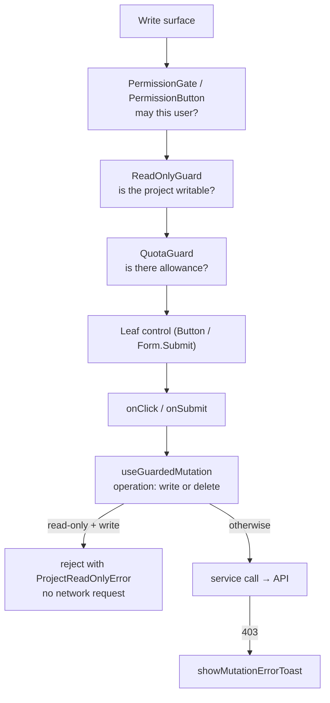

# Gating Write Actions

This guide answers one question: **when I add a mutation or a write button, what do I have to wrap it in?**

Three independent systems can block a write in this portal. Each answers a different question, and each has its own primitives. Getting the composition wrong does not fail loudly — it ships a button that looks enabled and 403s, or a button that looks disabled when it should work.

---

## Overview

| Layer         | Module                           | The question it answers         | Primitives                                                                        |
| ------------- | -------------------------------- | ------------------------------- | --------------------------------------------------------------------------------- |
| **RBAC**      | `app/modules/rbac`               | May this user do it?            | `useResourcePermissions`, `<PermissionButton>`, `<PermissionGate>`                |
| **Quota**     | `app/modules/quota`              | Is there allowance left?        | `useResourceQuota`, `<QuotaGuard>`                                                |
| **Read-only** | `app/features/project/read-only` | Is the project writable at all? | `useProjectMode`, `useGuardedMutation`, `<ReadOnlyGuard>`, `<GuardedWriteButton>` |

Read-only mode exists because a project can be **suspended**: the platform keeps reads and deletes working, but refuses every create/update with a 403. See [Project Suspension & Read-Only Mode](../enhancements/project-suspension-readonly-mode.md) for why the layer exists and how the verdict is derived.

### Two lines of defense, not one

Every project-scoped write is covered twice, at two different layers:

|                                        | Guarantees                                       | Cannot do                                          |
| -------------------------------------- | ------------------------------------------------ | -------------------------------------------------- |
| `useGuardedMutation` (data layer)      | No blocked request ever leaves the client        | Disable a button — it has no idea what rendered it |
| `ReadOnlyGuard` / `GuardedWriteButton` | The affordance is visibly disabled and explained | Stop a deep link, a stale tab, or a race           |

Neither substitutes for the other. Enumerating write surfaces is only dangerous as the **sole** line of defense — which is why the data-layer gate exists — but a correct-but-invisible gate produces a button that spins and then errors.

### How the layers compose



`GuardedWriteButton` encodes the `ReadOnlyGuard → QuotaGuard → PermissionButton` half of that chain in one component. Use it wherever it fits.

---

## Step 1: Adding a mutation hook

Mutation hooks live in `app/resources/{resource}/{resource}.queries.ts`. Which wrapper you use depends on the **scope of the resource**, not on the page that calls it.

### Project-scoped resources → `useGuardedMutation`

Swap `useMutation` for `useGuardedMutation` and declare the operation. Everything else about the options object is unchanged — it is a drop-in wrapper.

```diff
-import { useMutation, useQueryClient } from '@tanstack/react-query';
+import { useGuardedMutation } from '@/features/project/read-only/use-guarded-mutation';
+import { useQueryClient } from '@tanstack/react-query';

 export function useCreateDnsZone(
   projectId: string,
   options?: UseMutationOptions<DnsZone, Error, CreateDnsZoneInput>
 ) {
-  return useMutation({
+  return useGuardedMutation({
+    operation: 'write',
     mutationFn: (input: CreateDnsZoneInput) => createDnsZoneService().create(projectId, input),
     ...options,
```

`operation` is **required**. That is deliberate: the safe default is "blocked", and a new hook cannot be silently ungated by forgetting a flag.

> **Import path:** `*.queries.ts` files import `useGuardedMutation` from the deep path `@/features/project/read-only/use-guarded-mutation`, not from the barrel. The barrel re-exports React components, and pulling those into every data-layer module is a real bundle cost on a hot path. UI code imports from the barrel `@/features/project/read-only`.

### Org-scoped resources → plain `useMutation`

Billing accounts, members, groups, invitations, payment methods, organizations, and users stay on plain `useMutation`. **A suspended project must never block org-level work** — that is the whole reason the split exists.

Scope is a property of the hook, not of the file. `app/resources/policy-bindings/policy-binding.queries.ts` carries both kinds side by side:

```ts
// Org-scoped: plain useMutation
export function useCreatePolicyBinding(orgId: string, options?: …) {
  return useMutation({
    mutationFn: (input) => createPolicyBindingService().create(orgId, input),
    …
  });
}

// Project-scoped: gated
export function useCreateProjectPolicyBinding(projectId: string, options?: …) {
  return useGuardedMutation({
    operation: 'write',
    mutationFn: (input) => createProjectPolicyBindingService().create(projectId, input),
    …
  });
}
```

`app/resources/projects/project.queries.ts` splits the same way: `useUpdateProject` is gated (it is the project settings "Save", rendered inside `ProjectProvider`), while `useCreateProject` stays raw because creation takes no project argument, and `useDeleteProject` stays raw because deletes are never gated.

### Classify by what the service method does, not by the hook name

The `operation` tag describes the **user-visible action** the hook performs, resolved against the service method it actually calls. Two traps:

- **`useRevokeServiceAccountKey` is `'delete'`.** The name says "revoke", but `service-account.service.ts` calls `deleteIdentityMiloapisComV1Alpha1ServiceAccountKey` — an HTTP DELETE. Key revocation must keep working during suspension so customers can offboard credentials.
- **`useUpdateHttpProxy` is `'write'`**, even though its service tears down sub-resources with HTTP DELETEs along the way. The user is editing a proxy they are keeping. Proxy offboarding is `useDeleteHttpProxy`, which is `'delete'`.

When in doubt, open the service method and follow it to the generated client call.

---

## Step 2: Adding a write button

### The common case: `<GuardedWriteButton>`

When the leaf control is a `PermissionButton`, use `GuardedWriteButton`. It composes `ReadOnlyGuard → QuotaGuard → PermissionButton` in the one correct order, so you never hand-write the nesting.

```tsx
<GuardedWriteButton
  quota={{ resource: 'dnszones', group: 'dns.networking.miloapis.com', scope: 'project' }}
  resource="dnszones"
  verb="create"
  group="dns.networking.miloapis.com"
  scope="project"
  deniedReason="You don't have permission to add a DNS zone"
  type="primary"
  theme="solid"
  size="small"
  data-e2e="create-dns-zone-button"
  onClick={() => dialogRef.current?.show()}>
  <Icon icon={PlusIcon} className="size-4" />
  Add zone
</GuardedWriteButton>
```

Omit `quota` on surfaces with no live quota registration — the quota layer is then skipped entirely rather than mounting a guard that can only no-op.

### When the leaf is a plain `Button` or `Form.Submit`

`GuardedWriteButton` cannot express that shape. Nest the guards explicitly, with **`ReadOnlyGuard` inside `PermissionGate`**:

```tsx
<PermissionGate
  resource="dnszones"
  verb="patch"
  group="dns.networking.miloapis.com"
  scope="project"
  mode="disable"
  deniedReason="You don't have permission to edit this DNS zone">
  <ReadOnlyGuard>
    <Form.Submit size="xs" loadingText="Saving">
      Save
    </Form.Submit>
  </ReadOnlyGuard>
</PermissionGate>
```

Two rules are load-bearing here, and both are correctness, not taste:

- **`ReadOnlyGuard` goes INSIDE `PermissionGate`.** `PermissionGateProps` (`app/modules/rbac/components/PermissionGate.tsx`) declares no `disabled` prop at all, so a `disabled` cloned onto it from an outer guard is silently swallowed — the control keeps looking enabled and stays keyboard-operable behind a `pointer-events-none` wrapper. It does clone `disabled: true` **down** onto its child in `'disable'` mode, so a permission denial still reaches the leaf through the inner guard's `disabled` pass-through.
- **`ReadOnlyGuard` goes OUTSIDE `QuotaGuard`.** On a dual denial the read-only message should win the tooltip. The `disabled` still reaches the leaf because `QuotaGuard` forwards a received `disabled` onto its own child even when quota allows.

### Guard the write, not its container

Wrapping a component that also houses a read affordance (an Import/Export dropdown, a shared toolbar trigger) disables the shared trigger and takes the read down with it. Reads are never blocked by suspension — push the guard in to the write half.

---

## Step 3: Actions declared as config objects

Table empty states and row actions take a flat `{ disabled, tooltip }` pair instead of children, so they cannot nest guards. Use `deriveGuardedAction` and spread it:

```tsx
{
  type: 'button',
  label: 'Add zone',
  onClick: () => dialogRef.current?.show(),
  icon: <Icon icon={PlusIcon} className="size-3" />,
  ...deriveGuardedAction({
    isReadOnly,
    readOnlyReason,
    quotaDenied: zoneQuotaDenied,
    quotaReason: zoneQuotaReason,
    hasPermission: canCreate,
    permissionReason: "You don't have permission to add a DNS zone",
  }),
}
```

`isReadOnly` / `readOnlyReason` come from `useProjectMode()`, the quota pair from `useResourceQuota().denied` / `.deniedReason`, and `hasPermission` from `useResourcePermissions()`. Never re-derive the cascade by hand — divergence between copies is a silent correctness bug, because whichever message a given copy happens to pick becomes the only explanation the user gets.

---

## Step 4: Error toasts

For **any project-scoped write**, route the mutation's `onError` through `showMutationErrorToast`:

```tsx
const createSecret = useCreateSecret(projectId, {
  onError: (error) =>
    showMutationErrorToast(error, { fallbackTitle: 'Secret', scope: 'project', projectId }),
});
```

Never `toast.error(title, { description: error.message })` on a raw server error. A suspension admission 403's message embeds internal `ProjectSuspension` resource names (e.g. `abuse-2026-07-13-phishing`), and rendering it leaks operator-side detail to the customer. `showMutationErrorToast` recognizes both the client-side `ProjectReadOnlyError` and the server-side `ProjectSuspended` 403, renders the same sanitized toast for both, and dedupes them onto a stable toast id so the gate and the caller do not stack two toasts for one click.

If your call site has domain-specific error formatting, keep it via `fallbackDescription` — only the generic branch uses it, so the suspension and quota branches keep their own copy:

```tsx
showMutationErrorToast(error, {
  fallbackTitle: 'DNS Record',
  scope: 'project',
  projectId,
  fallbackDescription: error instanceof Error ? formatDnsError(error.message) : undefined,
});
```

---

## Precedence: read-only > quota > permission

When more than one layer denies, exactly one message is shown, in this order:

1. **Read-only** — the user's headroom and role are irrelevant while every write is refused.
2. **Quota** — "there's no capacity" is the actionable half of a dual denial.
3. **Permission**.

This order is encoded once, in `deriveGuardedAction` (`app/features/project/read-only/derive-guarded-action.ts`), and expressed structurally by the guard nesting for real controls. Do not re-implement it.

---

## Two invariants

These are correctness rules, not style preferences. Breaking either ships a user-visible bug.

### 1. Deletes are never gated

The platform's suspension admission blocks Create and Update only; reads and deletes always work, so customers can always offboard. A `'delete'` operation passes straight through `useGuardedMutation`, and delete buttons are not wrapped in `ReadOnlyGuard`.

If the UI invented a delete restriction the API does not have, a suspended customer would be unable to remove the very resources they are being billed for.

### 2. Gate only on a definitive read-only verdict

`isReadOnly` is `true` **only** on an explicit `Suspended` condition with status `'True'`. Missing status, absent condition, unparseable payload, or no ambient project all resolve to **writable**, and `ReadOnlyGuard` renders children unmodified while the verdict is unknown or loading.

A false "suspended" on a healthy project is worse than a missed one: the missed case still 403s at the server with a sanitized toast, while the false positive locks a paying customer out of their own project for no reason. This is the inverse of RBAC's fail-closed posture, and it is why the guard never flashes a denial during loading.

> Watch the polarity: on the `Suspended` condition, `'False'` is the **healthy** state — the opposite of `Ready`. Never infer suspension from `Ready`.

---

## Checklist

Before opening the PR:

- [ ] New mutation hook declares `operation: 'write' | 'delete'` — or is org-scoped and deliberately uses plain `useMutation`.
- [ ] `operation` matches what the **service method** does, verified by reading it (not inferred from the hook name).
- [ ] No new delete path is gated.
- [ ] Write button uses `GuardedWriteButton`, or nests `PermissionGate` → `ReadOnlyGuard` → leaf in that order.
- [ ] `ReadOnlyGuard` sits adjacent to a leaf that accepts `disabled`, and does not wrap a container that also holds a read affordance.
- [ ] Config-object actions use `deriveGuardedAction` rather than a hand-rolled ternary cascade.
- [ ] `onError` routes through `showMutationErrorToast`; no raw `error.message` in a toast for a project-scoped write.
- [ ] Manually verified against a suspended project: the button is disabled with a tooltip, and no network request fires on activation.

---

## Related Documentation

- [Project Suspension & Read-Only Mode](../enhancements/project-suspension-readonly-mode.md) — design record: platform contract, redaction rules, rejected alternatives, known gaps
- [Quota-Aware UI Gating](../enhancements/quota-aware-ui-gating.md) — the quota layer's design record
- `app/features/project/read-only/README.md` — module reference for the read-only layer
- `app/modules/quota/README.md` — quota module reference, including the dual-denial rule and banned patterns
- `app/modules/rbac/README.md`, `app/modules/rbac/CONVENTIONS.md` — RBAC module reference
- [Adding a New Resource](./adding-new-resource.md) — where `*.queries.ts` files come from
